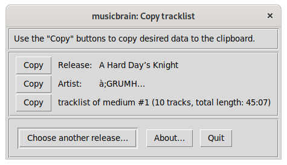
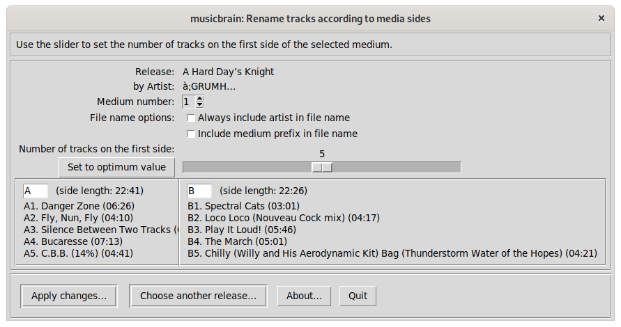
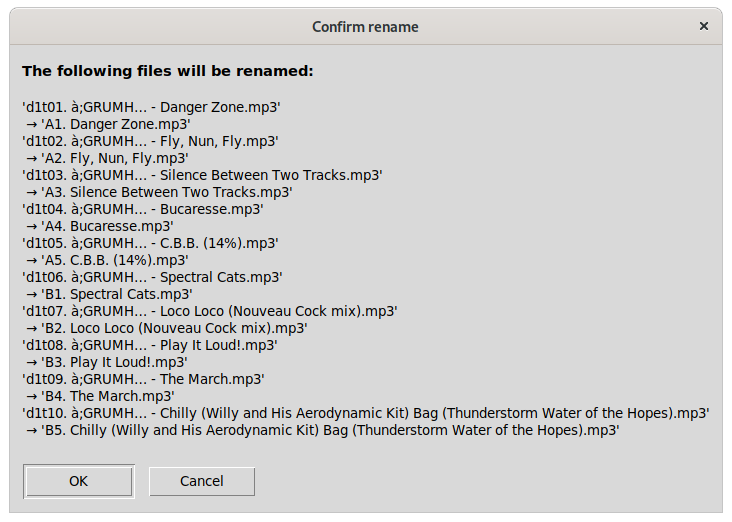

# musicbrain

__Scripts for audio files metadata access__

The GUI scripts support Nautilus (GNOME desktop file manager) integration
by putting a symbolic link into the ```~/.local/share/nautilus/scripts/```
directory.

## Requirements

The scripts in this project require the musicbrainzngs
and pytaglib python packages, see [requirements.txt](./requirements.txt>).

## The scripts

### Copy tracklist (copy_tracklist_gui.py)

Copy data of a release (name, artist, or tracklists – the latter in a
format that can be processed by [MusicBrainz](https://musicbrainz.org/)’
track parser) to the clipboard.



### Rename by sides (rename_by_sides_gui.py)

Rename tracks by media sides (read from file name prefixes,
guessed by track lenghts, or set by the user).

This script requires properly set metadata (at least ALBUM, ALBUMARTIST,
ARTIST, DISCNUMBER, TITLE and TRACKNUMBER) on all files in the directory.



Before actually renaming files, the script asks for confirmation:



## References

All examples on this page were created using the digitized files of
à;GRUMH…’s "A Hard Day’s Knight" vinyl release
(<https://musicbrainz.org/release/81712ade-acaf-4ccc-84e1-c8cc0c20bf4a>)

Nautilus scripts Howto: <https://help.ubuntu.com/community/NautilusScriptsHowto>
